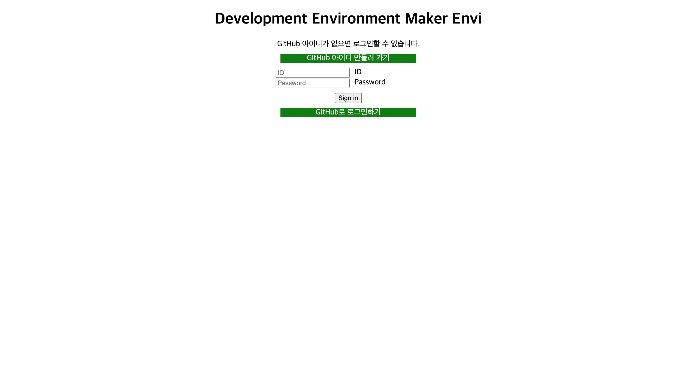
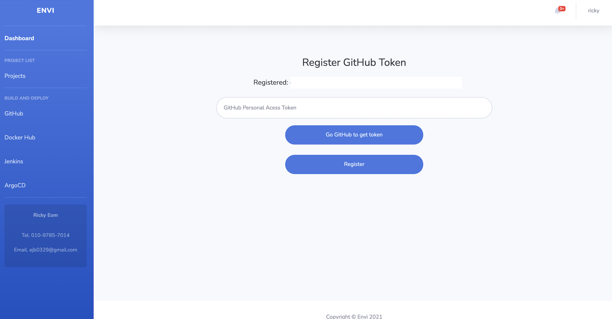
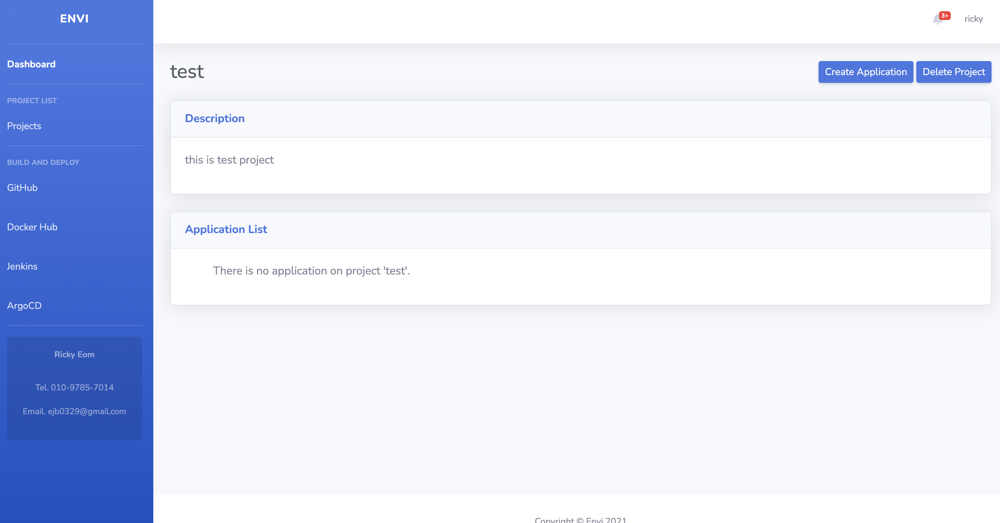
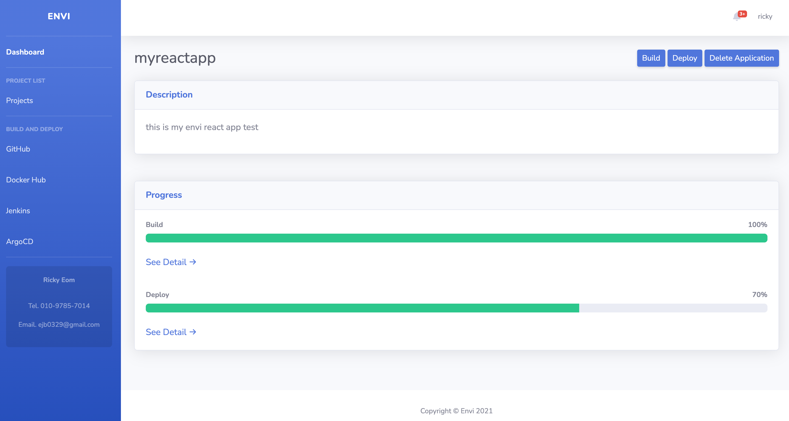
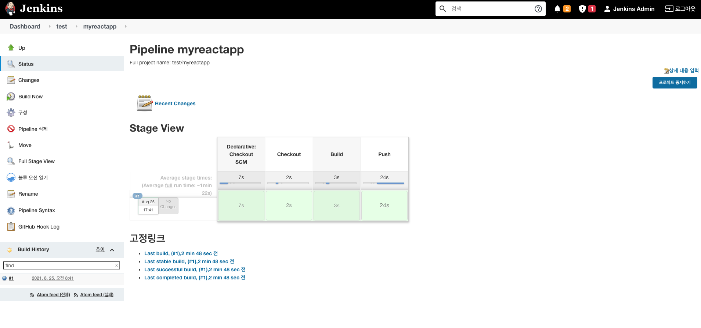

# 💁‍♂️ 개발 환경 구축 프로그램 ENVI를 소개합니다.
   
ENVI는 '코딩은 하고싶지만 개발환경 구축이 어려워😢'라고 하는 분들을 위한 개발 환경 자동 구축 프로그램입니다. 개발에 대한 인기가 많아진 만큼 많은 사람들이 코딩을 접하게 된 현재, 대부분의 주니어 개발자들은 코드를 작성하고 개발한 프로그램을 단순히 localhost에서 실행만 시켜보기만 한다는 것을 알게 되었습니다. 즉 서비스의 전체적인 운영 과정을 경험해보지 못한 사람이 많다고 생각이 들어 DevOps 엔지니어를 꿈꾸는 학생으로써 '서비스 개발 뿐만 아니라 운영까지 쉽게 관리할 수 있게 해주면 어떨까'라는 생각이 들어 프로젝트를 시작하게 되었습니다.    
 
### 동작 과정   
 

#### `1. 사용자 등록`
먼저 프로그램에 사용자를 등록하기 위해 회원가입을 진행해야 합니다. ENVI의 회원이 되기 위해서는 GitHub 계정을 필수로 가지고 있어야 합니다. 왜냐하면 ENVI의 모든 프로젝트 및 애플리케이션 동작은 사용자의 GitHub repository를 기반으로 수행되기 때문에 사용자는 GitHub 계정을 함께 등록해야 합니다. 로그인 과정에서는 GitHub OAuth를 포함하기 때문에 GitHub 계정으로도 ENVI에 로그인을 할 수 있습니다.  
  
 
#### `2. GitHub 토큰 등록`
로그인을 완료한 사용자는 GitHub 토큰을 등록해야합니다. 최근 GitHub의 credential 방식이 personal token으로 바뀐 만큼 ENVI 역시 사용자의 personal token을 사용하여 repository를 생성하고 파일을 업로드하도록 구현하였습니다.   
 
 
#### `3. 프로젝트 생성`
애플리케이션을 생성하기 전에 프로젝트를 생성해야 합니다. 프로젝트는 애플리케이션들을 하나로 묶은 큰 단위입니다. 프로젝트를 생성하면 입력한 정보에 기반하여 Jenkins에는 폴더가 만들어지고 ArgoCD에는 프로젝트가 생성됩니다. 이러한 구분을 통해 서로 다른 프로젝트에 속한 애플리케이션들을 구분합니다.   

 
#### `4. 애플리케이션 생성`
프로젝트를 생성했다면 프로젝트 정보 화면에서 애플리케이션을 생성할 수 있습니다. 애플리케이션을 생성하면 입력한 정보를 바탕으로 Jenkins Job과 GitHub repository가 생성되고 선택한 런타임에 따라 기본 애플리케이션 구조 및 빌드와 배포에 필요한 파일을 자동으로 업로드합니다. 이러한 파일들은 미리 만들어 둔 GitHub 계정에 업로드 된 파일로, 애플리케이션이 생성됨과 동시에 로컬로 파일을 다운로드받고 입력한 정보에 맞추어 파일 내용을 변경한 뒤 생성한 repository에 업로드하고 다운로드 받은 파일을 삭제합니다. 파일 다운로드 및 입출력, 바이트 처리를 수행하기 때문에 시간이 오래 소요됩니다.   
   
 
#### `5. 애플리케이션 빌드`
빌드 버튼을 클릭하면 Jenkins Job이 트리거되어 애플리케이션을 Docker 이미지로 빌드합니다. Jenkins는 helm 차트를 통해 설치되었기 때문에 **docker in docker** 형태로 구축되어있습니다. 따라서 Job이 트리거되어 파이프라인이 실행될 때마다 Pod를 생성하여 동작합니다. 빌드를 하기 위한 Dockerfile과 Jenkinsfile은 미리 정의해두었지만 사용자가 개발하는 코드에 따라 변경되어야 할 수 있습니다. 빌드한 이미지는 enviproject Docker 계정으로 DockerHub에 업로드됩니다. 또한 빌드 진행 상황을 바 형태로 나타나게 하였습니다.   
  
 
#### `6. 애플리케이션 배포`
배포 버튼을 클릭하면 Envi-Argo repository에 있는 helm 차트를 생성합니다. 이는 **appofapps** 패턴으로 구축되어있어, 하나의 프로젝트 내에 존재하는 다수의 애플리케이션을 한번에 관리할 수 있다는 장점을 가지고 있습니다. values.yaml 파일에 정의된 애플리케이션들을 배포하여 같은 형태로 관리합니다. appofapps 패턴은 토스 웨비나(Slash)를 참고하였습니다.  

    

---
    

### QnA 🧐
    

#### Q. 왜 이름이 ENVI 인가요?
A. ENVI는 Environment의 줄임말로 어떤 이름을 붙이면 좋을까 생각하다가 '엔비'라는 귀여운 어감이 끌려서 ENVI라고 지었습니다.   
    
#### Q. 클론만 하면 바로 사용할 수 있나요?
A. 현재 CSS 파일은 업로드하지 않았습니다. 또한 현재 버전은 프로토타입으로, React 애플리케이션만 생성이 가능합니다.   
 
#### Q. 개발 하는데 얼마나 걸렸나요?
A. 6월부터 계획해서 8월에 끝냈으니 대략 2~3개월 정도 소요되었습니다. 연구실 프로젝트를 함께 진행하다보니 생각보다는 늦었습니다.   
 
#### Q. 모두 다 혼자서 하신건가요?
A. 네, 혼자서 다했습니다! 함께 하는 팀 프로젝트도 중요하지만 혼자서 스스로 성장하는 방법을 아는 것도 엔지니어가 가져야 하는 능력중 하나라고 생각하기 때문에 이번 프로젝트는 개인으로 진행하였습니다.   
    
#### Q. 프로젝트를 진행하면서 아쉬웠거나 힘들었던 점이 있었나요?
A. 아무래도 프론트엔드쪽을 잘 모르기 때문에 비동기 처리와 같은 부분이 어려웠습니다. 그리고 로그인 과정에서 OAuth도 동작 구조가 복잡해서 처리하는데 많은 시간이 소요되었던 것 같습니다. 또한 전체적으로 개발하면서 클린코드의 중요성을 깨달았습니다. 혼자서 하는 프로젝트임에도 불구하고 변수의 이름이나 에러 핸들링 방법 등이 일정하지 않아서 이를 파악하는 과정이 힘들었습니다. 현재는 리팩토링을 거쳐 어느정도 통일성있는 형태이지만 분명 빠진 부분이 있을 것이라고 생각됩니다. 다음 프로젝트를 진행할 때에는 생각나는 대로 코드를 작성하기 보다 체계적으로 코드를 설계하고 작성하는 것이 중요하다는 생각이 들었습니다.   
    

---
  

### Project Info
    

__기술 스택 ⚒️__

- Golang
- Jquery
- Jenkins
- ArgoCD
- Docker
- Kubernetes   
    

---

    

### Links

[Project Repo.](https://github.com/JungBin-Eom/DevEnvMaker-Envi)

[Envi Template Repo.](https://github.com/Ricky-Envi)
